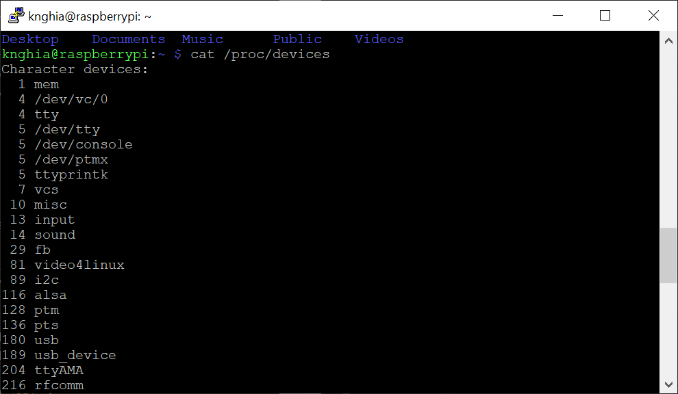

<span style="font-family: Courier New">

## 1. Major & minor
```shell
$ cat /proc/devices
```


## 2. Declaer the major & minor number
Include the library
```c
    #include <linux/types.h>
```
Declare the number
```c
    dev_t dev = MKDEV(7, 0);
```


## 3. Run

</span>